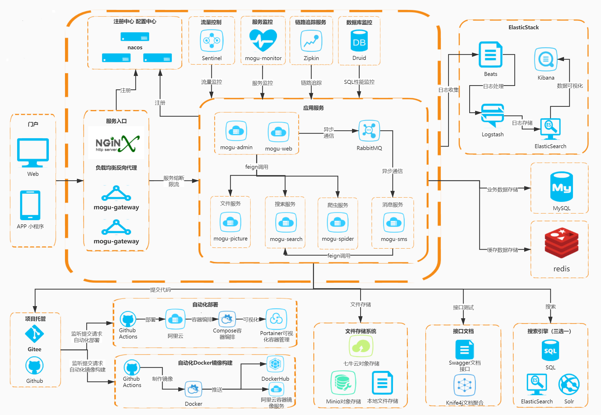

## 从零开始手把手撸码搭建前后端分离应用系列一：项目规划

一直以来想出一个前后端分离的教程，但是因为种种原因也没能实现(主要是因为自己太懒),总是一拖再拖，最近回顾了一下自己这些年的开发经历，简直羞愧不已，没什么建树，更没什么贡献，痛定失痛下，终于决定拾起当初一直想做却没有做的事情。

这个系列教程我们将从零开始，逐步完善，最终形成一个可用于商业的完整项目。

### 1.1节：系统架构图

### 1.2节：后端技术

|      技术      |           说明            |                             官网                             |
| :------------: | :-----------------------: | :----------------------------------------------------------: |
|   SpringBoot   |          MVC框架          | [ https://spring.io/projects/spring-boot](https://spring.io/projects/spring-boot) |
|  SpringCloud   |        微服务框架         |           https://spring.io/projects/spring-cloud/           |
| SpringSecurity |      认证和授权框架       |          https://spring.io/projects/spring-security          |
|  MyBatis-Plus  |          ORM框架          |                   https://mp.baomidou.com/                   |
|   Swagger-UI   |       文档生产工具        | [ https://github.com/swagger-api/swagger-ui](https://github.com/swagger-api/swagger-ui) |
|     Kibana     |     分析和可视化平台      |               https://www.elastic.co/cn/kibana               |
| Elasticsearch  |         搜索引擎          | [ https://github.com/elastic/elasticsearch](https://github.com/elastic/elasticsearch) |
|     Beats      |     轻量型数据采集器      |               https://www.elastic.co/cn/beats/               |
|    Logstash    | 用于接收Beats的数据并处理 |              https://www.elastic.co/cn/logstash              |
|      Solr      |         搜索引擎          |                http://lucene.apache.org/solr/                |
|    RabbitMQ    |         消息队列          |   [ https://www.rabbitmq.com/](https://www.rabbitmq.com/)    |
|     Redis      |        分布式缓存         |                      https://redis.io/                       |
|     Docker     |        容器化部署         |      [ https://www.docker.com](https://www.docker.com/)      |
|     Druid      |       数据库连接池        | [ https://github.com/alibaba/druid](https://github.com/alibaba/druid) |
|     七牛云     |     七牛云 - 对象储存     |         https://developer.qiniu.com/sdk#official-sdk         |
|      JWT       |        JWT登录支持        |                 https://github.com/jwtk/jjwt                 |
|     SLF4J      |         日志框架          |                    http://www.slf4j.org/                     |
|     Lombok     |     简化对象封装工具      | [ https://github.com/rzwitserloot/lombok](https://github.com/rzwitserloot/lombok) |
|     Nginx      |  HTTP和反向代理web服务器  |                      http://nginx.org/                       |
|    JustAuth    |     第三方登录的工具      |             https://github.com/justauth/JustAuth             |
|     Hutool     |      Java工具包类库       |                  https://hutool.cn/docs/#/                   |
|    阿里大于    |       短信发送平台        |            https://doc.alidayu.com/doc2/index.htm            |
| Github Actions |        自动化部署         |              https://help.github.com/en/actions              |
|     Zipkin     |         链路追踪          |             https://github.com/openzipkin/zipkin             |
| Flexmark-java  |     Markdown转换Html      |            https://github.com/vsch/flexmark-java             |
|   Ip2region    |     离线IP地址定位库      |          https://github.com/lionsoul2014/ip2region           |
|     Minio      |     本地对象存储服务      |                       https://min.io/                        |
| Docker Compose |      Docker容器编排       |               https://docs.docker.com/compose/               |
|   Portainer    |     Docker可视化管理      |            https://github.com/portainer/portainer            |

### 1.3节：前端技术

|         技术          |                  说明                   |                             官网                             |
| :-------------------: | :-------------------------------------: | :----------------------------------------------------------: |
|        Vue.js         |                前端框架                 |                      https://vuejs.org/                      |
|      Vue-router       |                路由框架                 |                  https://router.vuejs.org/                   |
|         Vuex          |            全局状态管理框架             |                   https://vuex.vuejs.org/                    |
|        Nuxt.js        |        创建服务端渲染 (SSR) 应用        |                    https://zh.nuxtjs.org/                    |
|        Element        |               前端ui框架                |    [ https://element.eleme.io](https://element.eleme.io/)    |
|         Axios         |              前端HTTP框架               | [ https://github.com/axios/axios](https://github.com/axios/axios) |
|        Echarts        |                图表框架                 |                      www.echartsjs.com                       |
|       CKEditor        |              富文本编辑器               |                    https://ckeditor.com/                     |
|     Highlight.js      |            代码语法高亮插件             |         https://github.com/highlightjs/highlight.js          |
|        Vditor         |             Markdown编辑器              |             https://github.com/Vanessa219/vditor             |
|      vue-cropper      |              图片裁剪组件               |           https://github.com/xyxiao001/vue-cropper           |
| vue-image-crop-upload |           vue图片剪裁上传组件           |      https://github.com/dai-siki/vue-image-crop-upload       |
|   vue-emoji-comment   |          Vue Emoji表情评论组件          |       https://github.com/pppercyWang/vue-emoji-comment       |
|     clipboard.js      |            现代化的拷贝文字             |                  http://www.clipboardjs.cn/                  |
|      js-beautify      |           美化JavaScript代码            |         https://github.com/beautify-web/js-beautify          |
|     FileSaver.js      |            保存文件在客户端             |           https://github.com/eligrey/FileSaver.js            |
|      SortableJS       |       功能强大的JavaScript 拖拽库       |                  http://www.sortablejs.com/                  |
|   vue-side-catalog    |               目录导航栏                |        https://github.com/yaowei9363/vue-side-catalog        |
|        uniapp         |            移动端跨平台语言             |                  https://uniapp.dcloud.io/                   |
|        colorUi        |         专注视觉的小程序组件库          |             https://github.com/weilanwl/ColorUI              |
|       showdown        | 用Javascript编写的Markdown 到Html转换器 |            https://github.com/showdownjs/showdown            |
|       turndown        | 用JavaScript编写的HTML到Markdown转换器  |           https://github.com/domchristie/turndown            |

### 1.4节：开发工具

|     工具     |       说明        |                             官网                             |
| :----------: | :---------------: | :----------------------------------------------------------: |
|     IDEA     |    Java开发IDE    |           https://www.jetbrains.com/idea/download            |
|   WebStorm   |    前端开发IDE    |             https://www.jetbrains.com/webstorm/              |
| RedisDesktop |  Redis可视化工具  | [ https://redisdesktop.com/download](https://redisdesktop.com/download) |
| SwitchHosts  |   本地Host管理    |             https://oldj.github.io/SwitchHosts/              |
|   X-shell    | Linux远程连接工具 |               https://xshell.en.softonic.com/                |
|    X-ftp     | Linux文件传输工具 |         https://www.netsarang.com/zh/all-downloads/          |
|    SQLyog    |  数据库连接工具   |               https://sqlyog.en.softonic.com/                |
| ScreenToGif  |    Gif录制工具    | [ https://www.screentogif.com/](https://www.screentogif.com/) |

### 1.5节：开发环境

|     工具      | 版本号 |                             下载                             |
| :-----------: | :----: | :----------------------------------------------------------: |
|      JDK      |  1.8   | https://www.oracle.com/technetwork/java/javase/downloads/jdk8-downloads-2133151.html |
|     Maven     | 3.3.0+ |                   http://maven.apache.org/                   |
| Elasticsearch | 6.3.0  |               https://www.elastic.co/downloads               |
|     Solr      |  7.0   |                http://lucene.apache.org/solr/                |
|     MySQL     |  5.6   |                    https://www.mysql.com/                    |
|    Erlang     |  20.3  |                   https://www.erlang.org/                    |
|   RabbitMQ    | 3.7.4  |            http://www.rabbitmq.com/download.html             |
|     Nginx     |  1.10  |              http://nginx.org/en/download.html               |
|     Redis     | 3.3.0  |                  https://redis.io/download                   |
|    Zipkin     | 2.12.5 | https://search.maven.org/remote_content?g=io.zipkin.java&a=zipkin-server&v=LATEST&c=exec |
|     Nacos     | 1.3.2  |          https://github.com/alibaba/nacos/releases           |
|   Sentinel    | 1.7.2  |         https://github.com/alibaba/Sentinel/releases         |
