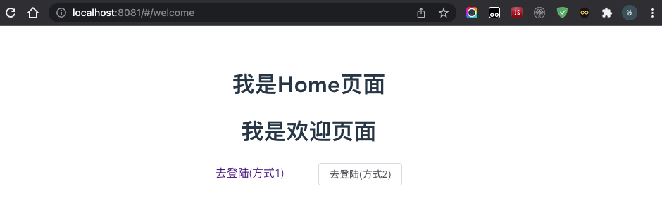
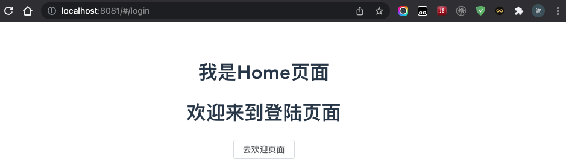

## 从零开始手把手撸码搭建前后端分离应用系列三：前端路由封装

在前面的章节中，我们利用Vite2已经创建了一个简单的Vue3前端应用，在这一章节中，我们对它进行完善，将路由进行封装。

### 3.1节：创建交互页面

在components目录中分别创建Home.vue,Login.vue以及Welcome.vue三个文件，Home为主页面，Login与Welcome为子页面，子页面之间可以相互跳转，代码如下：

Home.vue文件代码如下：

	
	
	<template>
	  

	    <h1>我是Home页面</h1>
	    <!-- 子页面路由显示 -->
	    <router-view></router-view>
	  

	</template>
	
	

Login.vue文件代码如下：

	<template>
		<h1>欢迎来到登陆页面</h1>
		<!-- 采用事件方式实现跳转 -->
		<el-button @click="goWelcome">去欢迎页面</el-button>
	</template>
	
	<!--
	当 
	
	

Welcome.vue文件代码如下：

	<template>
		<h1>我是欢迎页面</h1>
		<!-- 采用链接方式实现跳转 -->
		<router-link to="/login">去登陆(方式1)</router-link>
		&nbsp;&nbsp;&nbsp;&nbsp;&nbsp;&nbsp;&nbsp;&nbsp;&nbsp;
		<el-button @click="goLogin">去登陆(方式2)</el-button>
	</template>
	
	
	
	

### 3.2节：引入路由对象

在router路由目录下，创建index.js文件，并引入路由对象。

	import {createRouter,createWebHashHistory} from 'vue-router'
	import Home from '../components/Home.vue'
	import Login from '../components/Login.vue'
	import Welcome from '../components/Welcome.vue'
	
	// 定义路由跳转
	const routes = [
	    {
	        name:'home',
	        path:'/',
	        meta:{
	            title:'首页'
	        },
	        component:Home,
	        // 重定向
	        redirect:'/welcome',
	        children:[
	            {
	                name:'login',
	                path:'/login',
	                meta:{
	                    title:'登陆'
	                },
	                component:Login
	            },
	            {
	                name:'welcome',
	                path:'/welcome',
	                meta:{
	                    title:'欢迎'
	                },
	                component:Welcome
	            }
	        ]
	    }
	]
	
	const router = createRouter({
	    history: createWebHashHistory(),
	    routes
	})
	
	// 对外暴露的名称为
	export default router

### 3.3节：引入路由文件

在交互页面以及路由文件编写完成后，我们需要将路由文件引入main.js文件中，代码如下：

	import { createApp } from 'vue'
	import App from './App.vue'
	// 引入路由文件
	import router from './router'
	import ElementPlus from 'element-plus'
	import 'element-plus/dist/index.css'
	
	const app = createApp(App)
	app.use(ElementPlus)
	// 加载路由信息
	app.use(router)
	app.mount('#app')

当我们访问首页http://localhost:8081/时，程序重定向到welcome，我们看到的是欢迎页

当我们点击去登陆链接，页面会跳转到登录页面

当我们点击去欢迎页面按钮时，页面跳转到欢迎页。

至此，一个简单的路由跳转我们就开发完成了；

**总结：** 路由跳转的三种方式

- 方式1：router-link方式跳转

		<router-link to="/login">去登陆(方式1)</router-link>

- 方式2：传统方式跳转

		<el-button @click="goLogin">去登陆(方式2)</el-button>
		
		

- 方式3：Composition API跳转
		
		<el-button @click="goWelcome">去欢迎页面</el-button>
		
		

