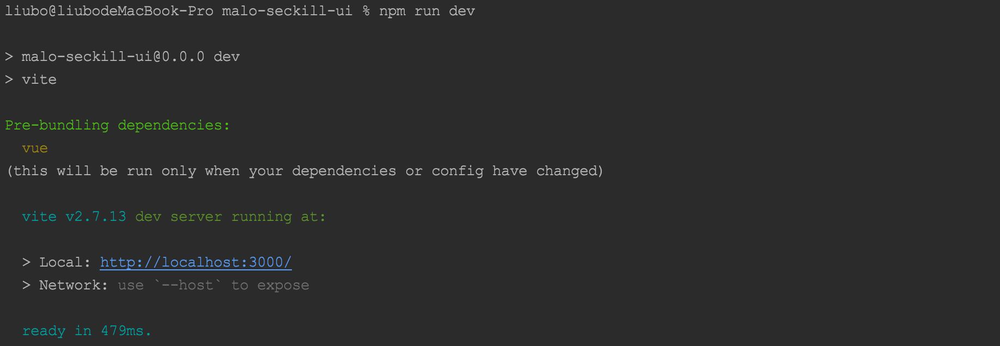
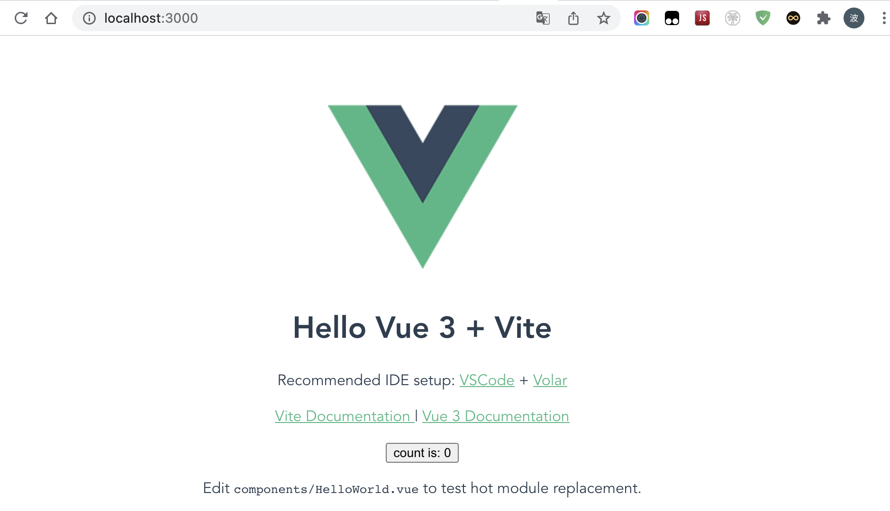
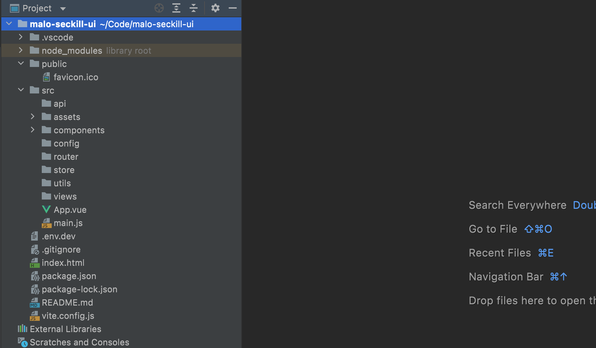
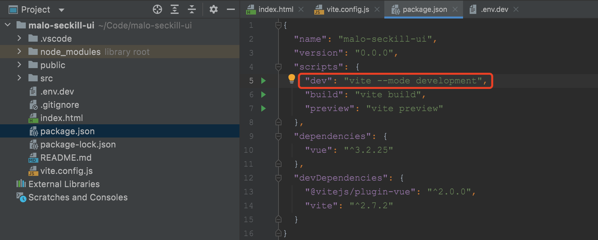
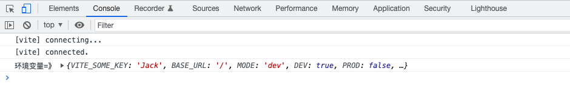
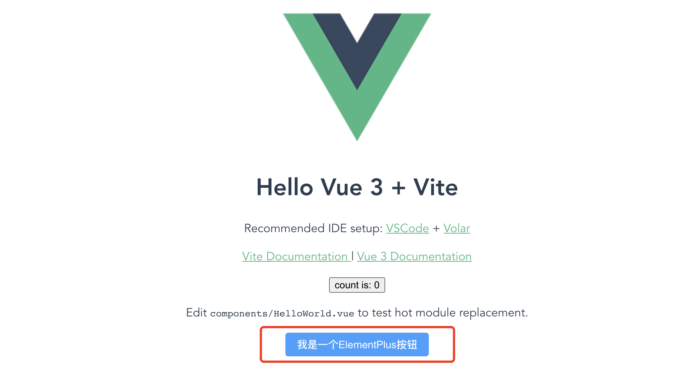

## 从零开始手把手撸码搭建前后端分离应用系列二：搭建前端项目

在前面的章节中，我们已经完成了项目基础环境的准备以及配置工作，那么，从这一章节开始，我们就进入前端项目的搭建工作；

### 2.1节：利用Vite2创建项目

	npm init @vitejs/app malo-seckill-ui
	## 或
	cnpm init @vitejs/app malo-seckill-ui
	## 或
	yarn init @vitejs/app malo-seckill-ui

创建项目有以上三种方式，根据自己的习惯任选其一即可；本文采用npm方式创建项目。

### 2.2节：启动项目

项目创建完成后，我们就可以安装依赖并启动项目了，如下：

	## 安装依赖
	npm install
	
	## 启动项目
	npm run dev

出现如下图所示表示项目启动成功。

这个时候我们打开浏览器，访问：http://localhost:3000/

至此，一个前端项目的架子我们已经搭建完毕，下面，我们来具体讲解下项目的结构。

### 2.3节：项目结构说明

如下图所示，一个常规的前端项目一般包含如下目录结构(部分目录项目创建的时候并不会自动生成，需要我们手动创建)，下面，我们对目录作用进行说明：

- dist 目录：项目构建(webpack)相关代码
- node_modules 目录：存放项目依赖的包目录
- public 目录：一些公用文件
- src 目录：这里是我们要开发的目录，基本上要做的事情都在这个目录里
- api 目录：所有请求
- assets 目录：主题，字体等静态资源
- components 目录：一个组件文件，可以不用
- config 目录：配置相关文件
- router 目录：路由
- store 目录：全局Store管理
- utils 目录：全局公用方法
- views 目录：页面文件
- APP.vue 文件：入口页面
- main.js 文件：项目的核心文件
- env.dev 文件：环境变量文件(env.dev 对应开发环境，env.prod 对应生产环境)
- .gitignore 文件：git忽略项
- index.html 文件：入口页面
- package.json 加载的项目依赖模块
- package-lock.json 锁定各个组件的版本
- README.md 文件：项目说明文件
- vite.config.js 文件：vite配置文件

### 2.4节：多环境配置

在开发过程中，我们通常涉及到多环境部署，比如dev，sit，uat，prod等，而不同的环境通常会存在不同的配置信息，那么，对于一个vite2+vue3项目，我们如何进行多环境配置呢？其实，问题也很简单，我们只需要找到项目中的package.json文件，然后在命令中增加 "--mode development" 即可，如下图：

Vite 在一个特殊的 import.meta.env 对象上暴露环境变量。这里有一些在所有情况下都可以使用的内建变量：

- import.meta.env.MODE: {string} 应用运行的模式。
- import.meta.env.BASE_URL: {string} 部署应用时的基本 URL。他由base 配置项决定。
- import.meta.env.PROD: {boolean} 应用是否运行在生产环境。
- import.meta.env.DEV: {boolean} 应用是否运行在开发环境 (永远与 import.meta.env.PROD相反)。

**生产环境替换**

在生产环境中，这些环境变量会在构建时被静态替换，因此，在引用它们时请使用完全静态的字符串。动态的 key 将无法生效。例如，动态 key 取值 import.meta.env[key] 是无效的。

它还将替换出现在 JavaScript 和 Vue 模板中的字符串。这本应是非常少见的，但也可能是不小心为之的。在这种情况下你可能会看到类似 Missing Semicolon 或 Unexpected token 等错误，例如当 "process.env.NODE_ENV" 被替换为 ""development": "。有一些方法可以避免这个问题：

- 对于 JavaScript 字符串，你可以使用 unicode 零宽度空格 \u200b (一个看不见的分隔符)来分割这个字符串，例如： 'import.meta\u200b.env.MODE'。
- 对于 Vue 模板或其他编译到 JavaScript 字符串的 HTML，你可以使用 <wbr> 标签，例如：import.meta.<wbr>env.MODE。

**.env文件**

	.env                # 所有情况下都会加载
	.env.local          # 所有情况下都会加载，但会被 git 忽略
	.env.[mode]         # 只在指定模式下加载
	.env.[mode].local   # 只在指定模式下加载，但会被 git 忽略

加载的环境变量也会通过 import.meta.env 暴露给客户端源码。

为了防止意外地将一些环境变量泄漏到客户端，只有以 VITE_ 为前缀的变量才会暴露给经过 vite 处理的代码。例如下面这个文件中：

	DB_PASSWORD=foobar
	VITE_SOME_KEY=123

只有 VITE_SOME_KEY 会被暴露为 import.meta.env.VITE_SOME_KEY 提供给客户端源码，而 DB_PASSWORD 则不会。

**模式**

默认情况下，开发服务器 (dev 命令) 运行在 development (开发) 模式，而 build 以及 serve 命令则运行在 production (生产) 模式。

这意味着当执行 vite build 时，它会自动加载 .env.production 中可能存在的环境变量：

	##.env.production
	VITE_APP_TITLE=My App

在你的应用中，你可以使用 import.meta.env.VITE_APP_TITLE 渲染标题。

然而，重要的是要理解 模式 是一个更广泛的概念，而不仅仅是开发和生产。一个典型的例子是，你可能希望有一个 "staging" (预发布|预上线) 模式，它应该具有类似于生产的行为，但环境变量与生产环境略有不同。

你可以通过传递 --mode 选项标志来覆盖命令使用的默认模式。例如，如果你想为我们假设的 staging 模式构建应用：

	vite build --mode staging

为了使应用实现预期行为，我们还需要一个 .env.staging 文件：

	# .env.staging
	NODE_ENV=development
	VITE_SOME_KEY=Jack

现在，你的 staging 应用应该具有类似于生产的行为，但显示的标题与生产环境不同。

我们输出一下环境变量看看效果，在main.js中加入一段如下代码：

	console.log("环境变量=》",import.meta.env)

然后打开浏览器控制台，刷新浏览器，得到如下信息：

关于vite的详细介绍我们在后续章节中进行讲解，当然也可以查看[Vite官网](https://vitejs.cn/guide/ "Vite官网")进行学习。

### 2.5节：安装Element-Plus

	## 安装项目生产依赖(vue-router，vuex，element-plus，axios)
	npm add vue-router@next vuex@next element-plus axios -S
	
	## 安装开发依赖
	npm add sass -D

**补充：**

	# npm
	$ npm install element-plus --save
	
	# yarn
	$ yarn add element-plus
	
	# pnpm
	$ pnpm install element-plus

- -S 后，自动把模块和版本号添加到dependencies,安装包会在package中的 dependencies对象中。简称dep。dep是在生产环境中要用到的。
- -D 后，自动把模块和版本号添加到devdependencies,安装包会在package中的 devDependencies对象中。简称dev。dev是在开发环境中要用到的。

举个例子：

构建工具：webpack是用来压缩代码，打包等需要的工具，程序实际运行的时候并不需要，就要放在dev中所以要用 -D。

项目插件：例如bootstrap、mint-ui这种插件要在运行中使用的，就要放在dep中所以就用 -S。

**项目中引入ElementPlus**

在main.js文件中加入如下代码：

	import { createApp } from 'vue'
	import ElementPlus from 'element-plus'
	import 'element-plus/dist/index.css'
	import App from './App.vue'
	
	console.log("环境变量=》",import.meta.env)
	
	const app = createApp(App)
	app.use(ElementPlus)
	app.mount('#app')

以上代码便完成了Element Plus的引入。需要注意的是，样式文件需要单独引入。

现在，我们在App.vue文件中加入一行代码，看看效果：

	<el-button type="primary">我是一个ElementPlus按钮</el-button>

从浏览器效果我们可以看出，Element Plus已经成功集成到项目中。

本章节到此告一段落，下一章节，我们将学习路由的封装。

