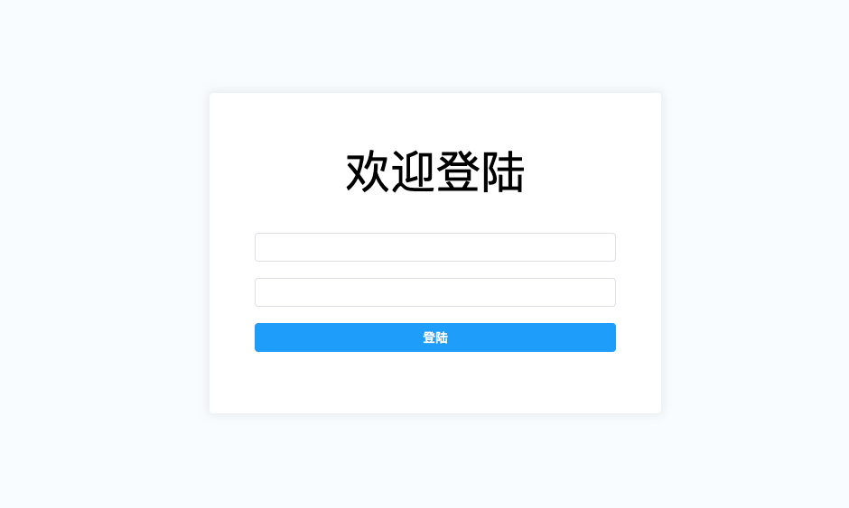

## 从零开始手把手撸码搭建前后端分离应用系列五：登陆页面设计

在前面的章节中我们已经完成了路由、Axios的封装，从本章节开始，我们将正式进入页面的开发，为了能够让大家能够更好的学习前端技能，我们先从最基础的登陆页面开始，然后再逐步的进行完善，话不多说，Let Go......

### 5.1节：新增登陆页面路由

在系列3章节中，我们引入了路由对象，定义了路由跳转，那么这次，我们对之前的代码稍作调整，将登陆路由跟首页路由放在相同的层级上，同时，在src目录下新建views文件夹，将Login.vue文件移动到views文件夹下，同时，路由调整后的代码如下：

```javascript
// 定义路由跳转
const routes = [
    {
        name:'home',
        path:'/',
        meta:{
            title:'首页'
        },
        component:Home,
        // 重定向
        redirect:'/welcome',
        children:[
            {
                name:'welcome',
                path:'/welcome',
                meta:{
                    title:'欢迎'
                },
                component:Welcome
            }
        ]
    },
    {
        name:'login',
        path:'/login',
        meta:{
            title:'登陆'
        },
        component:Login
    }
]
```

### 5.2节：新增登陆页面

登录页面Login.vue代码调整如下：

```vue
<template>
  <div class="login-wrapper">
    <div class="login-modal">
      <el-form :model="user" ref="loginForm" status-icon :rules="rules">
        <div class="login-title">欢迎登陆</div>
        <el-form-item prop="userCode">
          <el-input type="text" prefix-icon="el-icon-user" v-model="user.userCode"/>
        </el-form-item>
        <el-form-item prop="userPwd">
          <el-input type="password" prefix-icon="el-icon-view" v-model="user.userPwd"/>
        </el-form-item>
        <el-form-item>
          <el-button type="primary" class="login-btn" @click="login">登陆</el-button>
        </el-form-item>
      </el-form>
    </div>
  </div>
</template>

<script>
export default {
  name: 'login',
  data() {
    return {
      user: {
        userCode: '',
        userPwd: ''
      },
      rules: {
        userCode: [
          {
            required: true,
            message: "请输入用户名",
            trigger: "blur"
          }
        ],
        userPwd: [
          {
            required: true,
            message: "请输入密码",
            trigger: "blur"
          }
        ]
      }
    }
  },
  methods: {
    login() {
      this.$refs.loginForm.validate((valid) => {
        if (valid) {
          this.$request({
            url:'/demo',
            data:this.user
          }).then((res)=>{
            this.$router.push("/welcome")
          })
        }
      })
    }
  }
}
</script>

<style lang="scss">
.login-wrapper {
  display: flex;/*display: flex意思是弹性布局*/
  flex-direction: row;/*布局的排列方向 （主轴排列方向)*/
  /*补充1：
    row 默认值，显示为行。方向为当前文档水平流方向，默认情况下是从左往右。
    row-reverse 显示为行。但方向和row属性值是反的，在水平方向上为从右往左。
    column 显示为列 方向为在垂直方向上从上到下
    column-reverse 显示为列。但方向和column属性值是反的
  补充2:
    1.默认情况下，在弹性盒子中的子元素的左右排列的。
    2. 水平是主轴的时候：默认情况下，当宽高不写的时候，宽度由内容决定，高度由父容器决定。
    3. 垂直是主轴的时候：默认情况下，当宽高不写的时候，宽度由父容器决定，高度由内容决定。
    4. 当子项的总宽度大于父容器的时候，会自动收缩的（弹性的优先级是大于自身固定大小的）
    5.当子项的内容已经达到了父容器最小宽高的时候，就会出现溢出的现象。
  */
  justify-content: center;/*属性决定了主轴方向上子项的对齐和分布方式*/
  /*补充
    flex-start ： 子项都去起始位置对齐。
    flex-end ： 子项都去结束位置对齐。
    center ： 子项都去中心位置对齐。
    space-between : 表现为两端对齐。between是中间的意思，意思是多余的空白间距只在元素中间区域分配。
    space-around : around是环绕的意思，意思是每个flex子项两侧都环绕互不干扰的等宽的空白间距，最终视觉上边缘两侧的空白只有中间空白宽度一半。
    space-evenly : evenly是匀称、平等的意思。也就是视觉上，每个flex子项两侧空白间距完全相等。
   */
  align-items: center;/*每一行中的子元素上下对齐方式 flex-start:顶部对齐 center:居中对齐 flex-end:底部对齐*/
  background-color: #f9fcff;
  width: 100vw;
  height: 100vh;
  .login-modal {
    width: 500px;
    padding: 50px;
    background-color: #fff;
    border-radius: 4px;/*向元素添加圆角边框*/
    box-shadow: 0px 0px 10px 3px #c7c9cb4d;/*用于在元素的框架上添加阴影效果*/
    /*
    补充：
      normal	默认。设置合理的行间距。
      number	设置数字，此数字会与当前的字体尺寸相乘来设置行间距。
      length	设置固定的行间距。
      %	      基于当前字体尺寸的百分比行间距。
      inherit	规定应该从父元素继承 line-height 属性的值
    */
    .login-title {
      font-size: 50px;
      line-height: 1.5;/*设置行高*/
      text-align: center;
      margin-bottom: 30px;
    }
    .login-btn {
      width: 100%;
    }
  }
}
</style>
```

运行项目后，访问：http://localhost:8081/#/login 



为了对请求进行统一管理，我们将程序进行简单的优化，在src目录下，新增api目录，并创建index.js

```javascript
/**
 * API管理
 */
import request from './../utils/request'

export default{
    login(param) {
        return request({
            url:'/demo',
            data:param
        })
    }
}
```

在main.js中引入api

```javascript
import { createApp } from 'vue'
import App from './App.vue'
// 引入路由文件
import router from './router'
import ElementPlus from 'element-plus'
import 'element-plus/dist/index.css'
import request from './utils/request'
import api from './api/index'

const app = createApp(App)
app.config.globalProperties.$request = request;
// 引入api
app.config.globalProperties.$api = api;

app.use(ElementPlus)
// 加载路由信息
app.use(router)
app.mount('#app')
```

最终，登陆代码调整如下：

```javascript
<script>
export default {
  name: 'login',
  data() {
    return {
      user: {
        userCode: '',
        userPwd: ''
      },
      rules: {
        userCode: [
          {
            required: true,
            message: "请输入用户名",
            trigger: "blur"
          }
        ],
        userPwd: [
          {
            required: true,
            message: "请输入密码",
            trigger: "blur"
          }
        ]
      }
    }
  },
  methods: {
    login() {
      this.$refs.loginForm.validate((valid) => {
        if (valid) {
          // 登陆方法通过api进行管理
          this.$api.login(this.user).then((res) => {
            console.info("登陆成功。。。。。。")
            this.$router.push("/welcome")
          })
        }
      })
    }
  }
}
</script>
```

至此，一个简单的登陆页面我们就已经创建好 了。下一章节，我们将完成主页架构的设计。 

